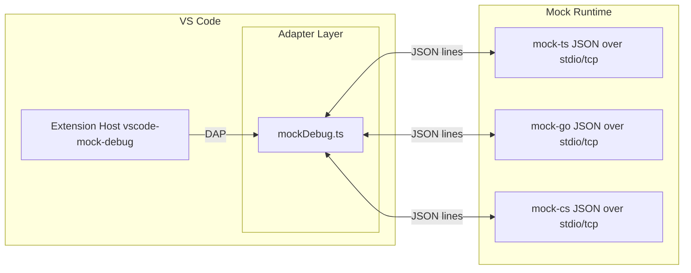

# VS Code Mock Debug Custon Runtimes
This repository extends [vscode-mock-debug](https://github.com/Microsoft/vscode-mock-debug.git)  to connect to runtimes/debuggers implemented in various languages.


# Mock Debug Runtime Suite

A small, multi-runtime mock debugger stack for experimenting with Debug Adapter concepts.
It includes:
- A C# “engine” and CLI that execute Markdown-like input with stepping, breakpoints, variables, and simple disassembly.
- A TypeScript runtime CLI with the same JSON-over-lines protocol (stdio/tcp).
- A VS Code mock debug extension (example) for quick end-to-end checks.

Both runtimes speak the same line-delimited JSON protocol described in `PROTOCOL.md`.

## Project Layout
- `mock-csharp/` — .NET runtime CLI with stdio/tcp server, matching the same protocol.
- `mock-ts/` — TypeScript runtime CLI with stdio/tcp server, matching the same protocol.
- `mock-go/` — Go runtime CLI with stdio/tcp server, matching the same protocol.
- `vscode-mock-debug/` — Example VS Code Mock Debug extension (TypeScript), useful for adapter-side testing.
- `PROTOCOL.md` — Transport and message shapes for the JSON-over-lines protocol.
- `AGENTS.md` — Notes on the development assistant used to make changes.

## Architecture
- Runtimes (C# or TS) read line-delimited JSON requests over stdio or TCP and emit responses/events per `PROTOCOL.md`.
- A debug adapter (e.g., the VS Code example) can spawn a CLI in stdio mode or connect to the TCP server.
- Runtimes simulate execution by stepping through words/lines of a text file, triggering events (breakpoints, output, exceptions).

### Diagram


## Protocol
- Transport: UTF-8, one JSON object per line (no Content-Length framing).
- Messages: `request`, `response`, `event` envelopes.
- See `PROTOCOL.md` for command list, payloads, and examples.

## Requirements
- Node.js 18+
- .NET SDK 8+
- Go 1.21+
- npm or yarn (for the VS Code extension or mock-ts)

## Build
- VS Code extension:
  - `cd vscode-mock-debug && npm install && npm run build`
- C# runtime (mock-csharp):
  - `dotnet build mock-csharp -c Debug`
- TypeScript runtime (mock-ts):
  - `cd mock-ts && npm run build`
- Go runtime
  - `cd mock-go && go build mock-go/cmd/mock-go`
cmd
```
cd vscode-mock-debug && npm install && npm run build
dotnet build mock-csharp -c Debug
cd mock-ts && npm run build && cd ..
cd mock-go && go build ./cmd/mock-go && cd ..
```
# Quick Start
* Clone the project
* Build runtimes you want to test.
* Open the vscode-mock-debug folder in VS Code.
* Press `F5` to build and launch Mock Debug in another VS Code window.
* In the explorer view of the new window open the 'program' file `readme.md`
* Set some breakpoints
* From the editor's "Run and Debug" toolbar dropdown menu select "Debug File" 

## Run: C# Runtime Server
`dotnet run --project mock-csharp/MockRuntime.Cli -- --server --host 127.0.0.1 --port 4711 [--program /abs/path.md] [--stop-on-entry]`

## Run: TypeScript Runtime Server
`node mock-ts/dist/cli.js --server --host 127.0.0.1 --port 4711 [--program /abs/path.md] [--stop-on-entry]`

## Run: Go Runtime Server
`./mock-go --server --host 127.0.0.1 --port 4711 [--program /abs/path.md] [--stop-on-entry]`

## VS Code Example Extension
- Open `vscode-mock-debug` in VS Code.
- `npm install && npm run build`.
- Press F5 to “Run Extension” and launch a Mock Debug session from the example’s provided configurations.
- Sample workspace launch configs include C#, TS, and Go variants:
  - C#: uses `mock-csharp/MockRuntime.Cli` build output.
  - TS: uses `node ../../mock-ts/dist/cli.js`.
  - Go: uses `../../mock-go/mock-go` (build first via `cd mock-go && go build ./cmd/mock-go`).
- You can point the adapter to any runtime by setting `runtimeExe` and optional `runtimeArgs` to spawn the CLI and relay DAP requests as JSON-over-lines.


## Features
- Stepping: continue, next (over), stepIn (into character), stepOut (out by character).
- Breakpoints: source (line), data (variable read/write), instruction (word index), and exception filters.
- Stack + Disassembly: stack frames from the current line’s words; disassembly exposes word stream with addresses.
- Variables: local get/set with simple structured values; synthetic global variables for demos.
- Events: stopped (entry/breakpoint/step/dataBreakpoint/instructionBreakpoint/exception/pause), output, terminated.

## Parity Notes
- Both runtimes implement the same request/response/event shapes as `PROTOCOL.md`.
- Breakpoint verification: a breakpoint is “verified” if the target line is non-empty; no automatic line shifting.
- Stop-on-entry: launches can stop immediately at entry before any execution.

## How to add new Runtime
- **Goal:** Provide a CLI that speaks the same JSON-over-lines protocol in `PROTOCOL.md`.
- **Transport:** Support `stdio` (required). TCP server is optional but recommended (`--server --host --port`).
- **Envelope:** Implement `request` → `response|event` with zero-based line/column semantics.
- **Commands:** At minimum, handle `initialize`, `launch`, `attach`, `continue`, `pause`, `next`, `stepIn`, `stepOut`, `disconnect`, `stackTrace`, `setBreakpoints`, `breakpointLocations`, `breakpointLines`, `disassemble`, variables (`getLocalVariables|getLocalVariable|setVariable|getGlobalVariables`), and exception/data/instruction breakpoint commands.
- **Events:** Emit `stopped` (reasons: `entry|breakpoint|step|dataBreakpoint|instructionBreakpoint|exception|pause`), `output`, and `terminated`.
- **Behavior:**
  - **Verify breakpoints:** mark verified only if the target line is non-empty; do not shift lines.
  - **Stop-on-entry:** on `launch` with `stopOnEntry`, emit a stopped event immediately.
  - **Disassembly/stack:** derive frames/instructions from source words to mirror examples.
- **CLI options:** Mirror others: `--server --host 127.0.0.1 --port 4711 [--program /abs/file.md] [--stop-on-entry]`.
- **Structure:** Place under a new folder (e.g., `mock-rust/`, `mock-python/`) with clear build scripts and a short README.
- **Testing:**
  - Pipe JSON lines by hand or via a small script to validate round-trips.
  - Use the VS Code example extension to spawn your CLI (stdio) or connect via TCP.
  - Compare behavior with `mock-csharp`/`mock-ts` for parity.


## Troubleshooting
- If a CLI appears idle, ensure you’re sending exactly one JSON object per line (newline-terminated) and escaping internal newlines in strings.
- For TCP tests, confirm host/port and that only one client connects at a time.
- The VS Code example includes its own mock engine for comparison; use it to isolate adapter vs. runtime issues.

## Contributing
- Keep runtime and protocol behavior aligned with `PROTOCOL.md`.
- Prefer small, explicit methods and clear names (TS/C#/GO).
